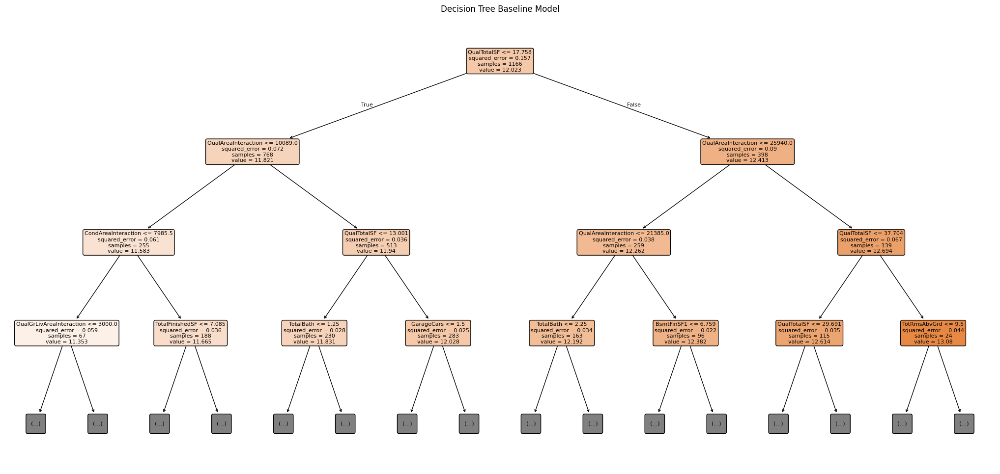

# Ames House Price Regression


## Project Overview

This project is an end-to-end machine learning regression project for predicting house sale prices using the Ames Housing dataset.

The goal of this project is to build a reliable regression model that can estimate house prices from property-related features such as overall quality, living area, neighborhood, garage information, basement features, year built, remodeling year, and other housing attributes.

The project includes exploratory data analysis, feature engineering, model training, validation, and final prediction generation.

---

## Project Preview



---

## Problem Statement

House prices depend on many factors such as size, location, construction quality, age, condition, basement area, garage capacity, and neighborhood characteristics.

The objective of this project is to predict the final house sale price using the available numerical and categorical features.

This is a supervised machine learning regression problem.

---

## Dataset

The project uses the Ames Housing dataset.

Main files:

```text
Data/
├── train.csv
├── test.csv
├── sample_submission.csv
└── data_description.txt
```

Target variable:

```text
SalePrice
```

---

## Project Workflow

```text
Raw Data
   ↓
Exploratory Data Analysis
   ↓
Missing Value Analysis
   ↓
Outlier Handling
   ↓
Feature Engineering
   ↓
Feature Encoding
   ↓
Model Training
   ↓
Cross Validation
   ↓
Model Comparison
   ↓
Final Prediction
   ↓
Submission File
```

---

## Exploratory Data Analysis

The EDA notebook was used to understand the dataset and identify important patterns before modeling.

Main EDA tasks:

- Checked dataset shape and feature types
- Analyzed missing values
- Studied numerical and categorical features
- Analyzed the target variable distribution
- Checked skewness in `SalePrice`
- Explored relationships between important features and house prices
- Reviewed outliers
- Identified strong price-related features

Important observations:

- `SalePrice` is right-skewed, so log transformation is useful for stable regression modeling.
- Overall quality has a strong relationship with house price.
- Living area, garage capacity, basement area, and neighborhood are important price-related factors.
- Some missing values represent absence of a feature, such as no garage, no basement, no pool, or no alley access.
- Outliers need careful handling because extreme values can strongly affect regression models.

---

## Feature Engineering

Feature engineering was one of the most important parts of this project.

Main feature engineering steps:

- Handled missing values based on feature meaning
- Converted meaningful missing categorical values into `"None"`
- Applied log transformation to the target variable
- Created total area-based features
- Created bathroom-related features
- Created age and remodeling-related features
- Created binary indicator features
- Handled skewed numerical variables
- Encoded categorical variables
- Prepared train and test data for modeling

Example engineered features:

```text
TotalSF
TotalBathrooms
HouseAge
RemodAge
GarageAge
TotalPorchSF
HasGarage
HasBasement
HasPool
HasFireplace
```

---

## Models Used

Several regression models were trained and compared.

Models used in this project include:

- Ridge Regression
- ElasticNet
- Bayesian Ridge
- Support Vector Regression
- CatBoost Regressor
- Ensemble / Stacking Model

---

## Model Evaluation

The main evaluation metric used in this project is RMSE on the log-transformed target.

```text
Metric: RMSE / Log RMSE
```

The model performance was evaluated using cross-validation to make the result more reliable and reduce the risk of depending on a single train-validation split.

---

## Key Results

The project achieved strong regression performance using feature engineering and ensemble modeling.

Summary:

- Built a complete regression workflow
- Improved the dataset through advanced feature engineering
- Compared multiple machine learning models
- Used cross-validation for reliable model evaluation
- Generated final prediction files for submission
- Organized the final project into a clean GitHub portfolio structure

---

## Repository Structure

```text
Ames-Price-Regression/
│
├── Data/
│   ├── train.csv
│   ├── test.csv
│   ├── sample_submission.csv
│   └── data_description.txt
│
├── Notebook/
│   ├── Exploratory_Data_Analysis.ipynb
│   ├── Feature_Engineering.ipynb
│   ├── Model_training.ipynb
│   └── feature_groups.py
│
├── report/
│   ├── ames_house_price_dataset_guide.md
│   ├── ames_ml_review.md
│   ├── corrected_fe_plan_no_code.md
│   ├── feature_engineering_plan_report.md
│   ├── feature_engineering_problems.md
│   ├── improved_all_eda_reports_combined.md
│   ├── planing.excalidraw
│   └── reformed_feature_engineering_plan.md
│
├── output.png
├── .gitignore
└── README.md
```

---

## How to Run This Project

### 1. Clone the repository

```bash
git clone https://github.com/kawsar07ahmmed0712-rgb/Ames-Price-Regression.git
cd Ames-Price-Regression
```

### 2. Create a virtual environment

```bash
python -m venv venv
```

Activate the environment.

For Windows:

```bash
venv\Scripts\activate
```

For macOS/Linux:

```bash
source venv/bin/activate
```

### 3. Install required libraries

```bash
pip install numpy pandas matplotlib seaborn scikit-learn scipy catboost jupyter
```

### 4. Open Jupyter Notebook

```bash
jupyter notebook
```

Run the notebooks in this order:

```text
1. Notebook/Exploratory_Data_Analysis.ipynb
2. Notebook/Feature_Engineering.ipynb
3. Notebook/Model_training.ipynb
```

---

## Technologies Used

- Python
- NumPy
- Pandas
- Matplotlib
- Seaborn
- Scikit-learn
- SciPy
- CatBoost
- Jupyter Notebook

---

## Skills Demonstrated

This project demonstrates the following machine learning and data science skills:

- Data cleaning
- Exploratory data analysis
- Missing value handling
- Outlier analysis
- Feature engineering
- Feature encoding
- Regression modeling
- Cross-validation
- Model comparison
- Ensemble learning
- Submission file generation
- GitHub project organization

---

## Important Files

| File | Description |
|---|---|
| `Notebook/Exploratory_Data_Analysis.ipynb` | Exploratory data analysis and initial dataset understanding |
| `Notebook/Feature_Engineering.ipynb` | Missing value handling, feature creation, transformation, and encoding |
| `Notebook/Model_training.ipynb` | Model training, validation, comparison, and final prediction |
| `Notebook/feature_groups.py` | Feature grouping helper file |
| `Data/train.csv` | Training dataset |
| `Data/test.csv` | Test dataset |
| `Data/data_description.txt` | Dataset feature description |
| `report/` | Supporting project reports and planning files |

---

## Future Improvements

Possible future improvements:

- Add a `requirements.txt` file
- Convert notebook code into reusable Python scripts
- Add a clean `src/` pipeline
- Save the best trained model using `joblib`
- Build a Streamlit web application
- Add SHAP-based model explainability
- Add automated training and prediction scripts
- Add final model performance charts to the README

---

## Conclusion

This project presents a complete machine learning workflow for house price prediction using the Ames Housing dataset.

The project covers data analysis, feature engineering, model training, validation, and prediction generation. Through proper preprocessing, strong feature engineering, and model comparison, the project builds a solid regression pipeline for predicting house sale prices.

---

## Author

**Kawsar Ahmmed**

GitHub: [kawsar07ahmmed0712-rgb](https://github.com/kawsar07ahmmed0712-rgb)

---

## License

This project is open-source and available under the MIT License.